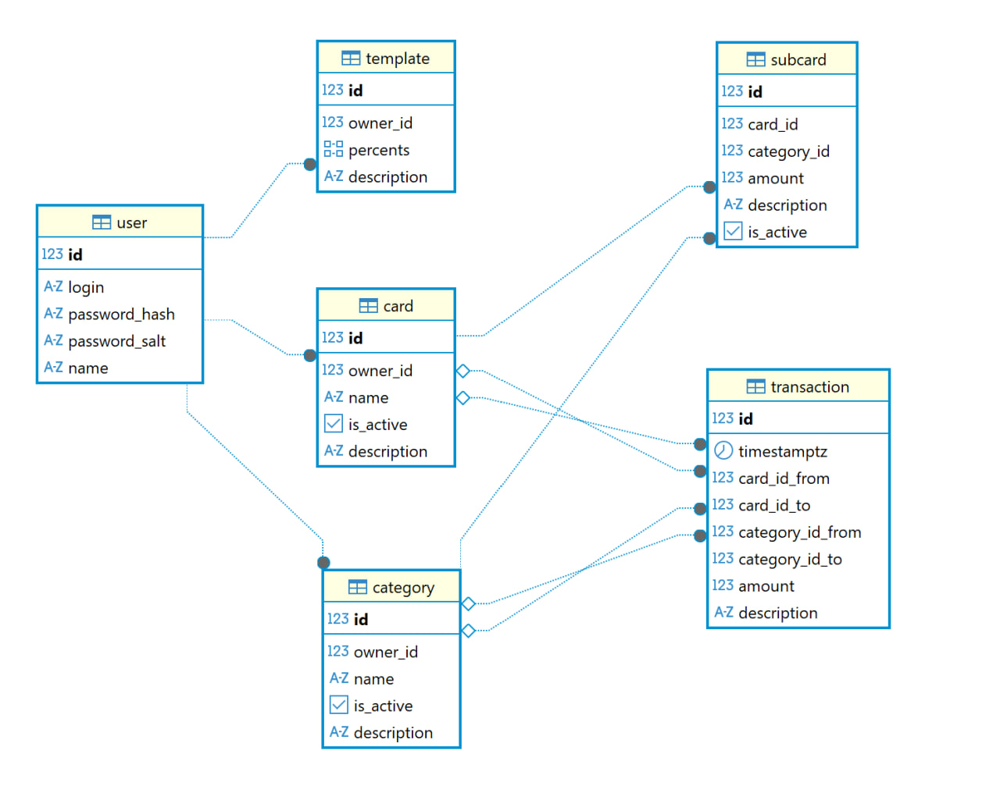

# Проект для удобного и быстрого наката БД

В данном проекте для миграций используется liquibase, что позволяет, 
как интегрироваться и с другими СУБД, так и удобно производить релизв существующих БД.

Для того чтобы начать работать с миграциями, необходимо:
1. Скачать [java 21](https://www.oracle.com/java/technologies/javase/jdk21-archive-downloads.html) или более новую версию
2. Скачать [maven](https://maven.apache.org/download.cgi), если планируете сами смотреть и изменять скрипты наката и отката
3. Запустить программу, находясь в корневой директории проекта (рядом с pom.xml) с помощью команд:
   1. mvn liquibase:update (для наката)
   2. mvn liquibase:rollback -Dliquibase.rollbackCount=1 (для отката (rollback=1 - сколько файлов xml надо откатить, если акая возможность имеется))

В будущем планируется создать версионированный jar-ик только для наката БД

